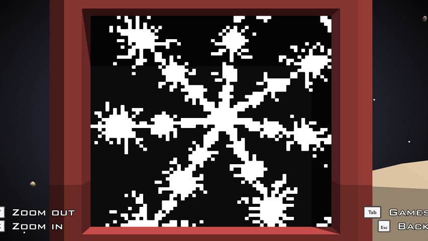

# Redirection Mandelbrot viewer
 Mandelbrot set viwer for redirection arcade.
 
## Mandelbrot set
The Mandelbrot set is the set of complex numbers *c* for which the function *f(z)=z^2+c* does not diverge when iterated from *z=0*.  
In practice, one calculates a limited number of iterations. If in those iterations the magnitude grows beyond *2* we know the sequence diverges. Otherwise we assume it converges.  
In this arcade, the code responsible for telling wheter a given point lies inside or outside the set is
```
function isIn(x, y)
	zx, zy = 0, 0
	for i = 1, 80 do
		if zx*zx+zy*zy > 4 then
			return false
		end
		zx, zy = zx*zx-zy*zy+x, 2*zx*zy+y
	end
	return true
end
```
The whole set lies in the circle of *|z| <= 2 and looks like this  


## Redirection robot arcade
Robot comprises 64×64 B/W screen, 4 directional joystick and two buttons. These can be used to move around and zoom in/out on parts of the complex plane.  
In game it may look something like this  
  
The whole code is very straightforward and less than 100 lines in Lua.
If you are interested, check it on [Steam workshop](https://steamcommunity.com/sharedfiles/filedetails/?id=1494079701).